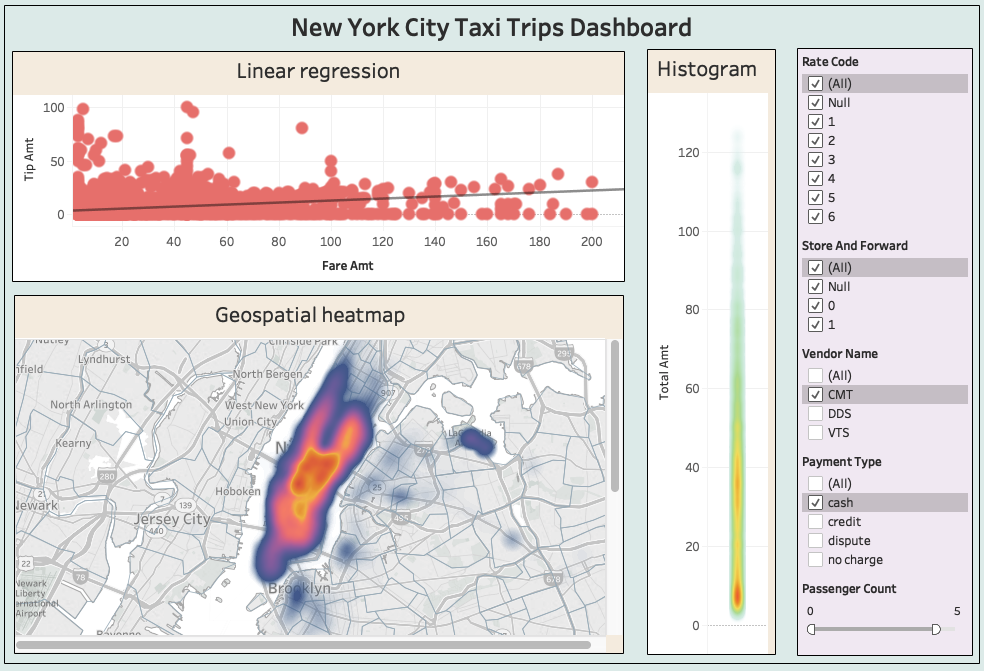
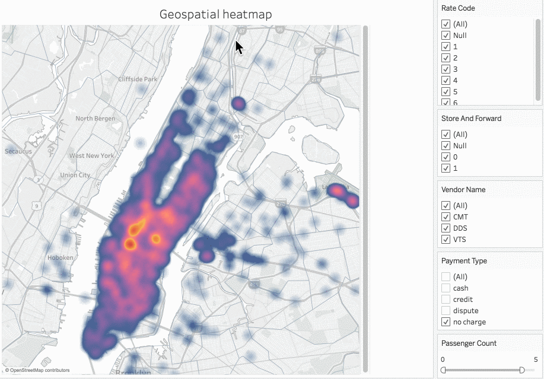

# Tabula: Accelerating Spatial Data Visualization Dashboards via a Materialized Sampling Approach

[](https://travis-ci.org/DataSystemsLab/Tabula)

## Spatial data visualization dashboard




A user visually explores a spatial dataset using a visualization dashboard, such as Tableau and ArcGIS. Each user interaction with the dashboard often involves an iteration between the dashboard and underlying data system. In each iteration, the dashboard application first issues a query to extract the data of interest from the underlying data system (e.g., PostGIS and SparkSQL), and then runs the visual analysis task (e.g., heat map and statistical analysis) on the selected data. Based on the visualization result, the user may iteratively go through such steps several times to visually explore various subsets of the database.


## What is Tabula

Tabula is a middleware that sits between the data system and the spatial data visualization dashboard to reduce the data-to-visualization time. 

* **Pre-materialized samples**: Tabula adopts a sampling cube approach that stores pre-materialized sample for a set of potentially unforeseen queries (represented by an OLAP cube cell).
* **User-defined analysis tasks:**: Tabula allows data scientists to define their own accuracy loss function such that the produced samples can be used for various user-defined visual analysis tasks. 
* **Deterministic accuracy loss**: Tabula ensures that the difference between the sample fed into the visualization dashboard and the raw query answer never exceeds the user-specified loss threshold with 100% confidence level.

## How to use Tabula

### Initialization

The user feeds such parameters to Tabula as follows:

```
CREATE TABLE [sampling cube name] AS
	SELECT [cubed attributes], SAMPLING(*,[θ]) AS sample
	FROM [table name]
	GROUPBY CUBE([cubed attributes])
	HAVING [loss function name]([attribute], Sam global ) > [θ]
```

Example:

```
CREATE TABLE SamplingCube AS
	SELECT Trip_distance, Passenger_count, Payment_method, SAMPLING(*,10%) AS sample
	FROM nyctaxi
	GROUPBY CUBE(Trip_distance, Passenger_count, Payment_method)
	HAVING loss(Fare_amount, Sam_global ) > 10%
```

### Query

Once the sampling cube in Tabula is initialized, the data scientist, via the analytics application, can issue SQL queries to Tabula, as follows:

```
SELECT sample
FROM [sampling cube name]
WHERE [conditions]
```

Example:

```
SELECT sample
FROM SamplingCube
WHERE Trip_distance = 1 AND Payment_method = 'cash'
```

## Implementation details

1. Currently, Tabula is implemented on top of Apache SparkSQL 2.3. In the future, we will show how to extend Tabula to more data systems such as PostgreSQL.
2. The current code contains a geospatial-visualization aware accuracy loss function as an example at this location: [Tabula cube](https://github.com/DataSystemsLab/Tabula/blob/master/src/main/scala/org/datasyslab/samplingcube/cubes/Tabula.scala)
3. We will soon release more examples about how to write user-defined accuracy loss functions in Tabula. Stay tuned.
4. Some compared approaches are provided here: [Related work](https://github.com/DataSystemsLab/Tabula/tree/master/src/main/scala/org/datasyslab/samplingcube/relatedwork)
5. We also compare with SnappyData in this repository: [SnappyData VS Tabula](https://github.com/jiayuasu/snappydata-versus-tabula)

## Contributors

[Jia Yu](http://www.public.asu.edu/~jiayu2/)

[Mohamed Sarwat](http://faculty.engineering.asu.edu/sarwat/)
